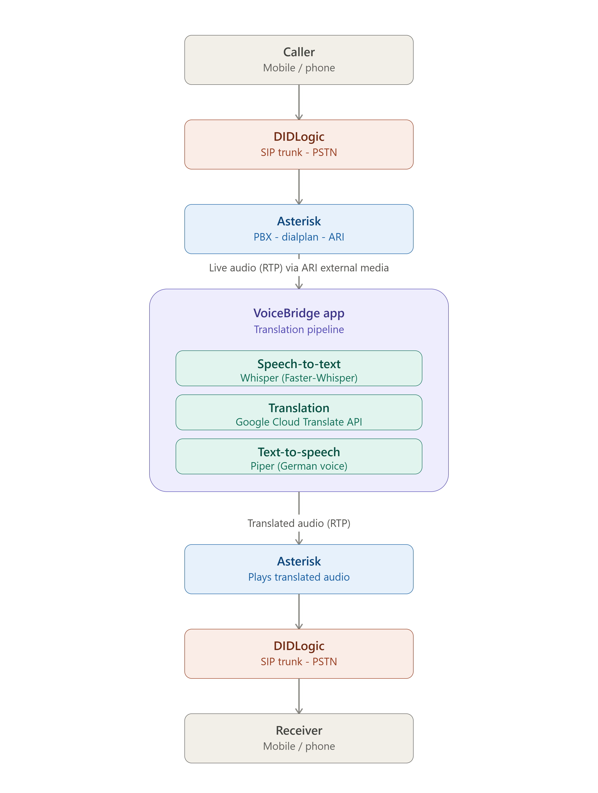

# VoiceBridge

VoiceBridge is a real-time voice translation pipeline for phone calls. A caller dials in, speaks in their language, and the system transcribes, translates, and speaks the translation back — bridging two speakers across a language barrier over a normal phone call.

The project started as a local microphone-based prototype and has since evolved into a telephony-integrated system, routing real calls through a SIP/Asterisk layer into the translation pipeline.

**Author:** Shruti Shukla

## How It Works



```text
Caller (mobile/phone)
        │
        ▼
DIDLogic (SIP trunk – PSTN)
        │
        ▼
Asterisk (PBX, dialplan, ARI)
        │  Live audio (RTP) via ARI external media
        ▼
VoiceBridge app (translation pipeline)
        ├─ Speech-to-text   → Faster-Whisper
        ├─ Translation      → Google Cloud Translation API v3
        └─ Text-to-speech   → Piper (German voice)
        │  Translated audio (RTP)
        ▼
Asterisk (plays translated audio)
        │
        ▼
DIDLogic (SIP trunk – PSTN)
        │
        ▼
Receiver (mobile/phone)
```

## Features

* **Telephony Integration** — Real phone calls are routed through Asterisk/SIP into the pipeline, rather than requiring local microphone input.
* **Speech Recognition** — Transcribes spoken audio using the Faster-Whisper ASR model.
* **Machine Translation** — Translates text using the Google Cloud Translation API v3.
* **Text-to-Speech Playback** — Converts translated text into natural-sounding speech using Piper (German voice).
* **Cloud-Hosted Pipeline** — Runs on a DigitalOcean Droplet (Frankfurt) rather than a local machine, enabling it to handle real inbound calls.
* **Latency-Optimized** — Actively benchmarked and tuned to meet a target end-to-end processing time.

## Technologies Used

| Component        | Technology                                        |
| ----------------- | -------------------------------------------------- |
| SIP Trunk / PSTN  | DIDLogic                                            |
| Telephony / PBX   | Asterisk (dialplan + ARI, external media for live RTP) |
| Hosting           | DigitalOcean Droplet (Ubuntu, Frankfurt)            |
| Speech-to-Text    | Faster-Whisper                                      |
| Translation       | Google Cloud Translation API v3                     |
| Text-to-Speech    | Piper (German voice)                                |
| Audio Handling    | pygame, NumPy, SciPy                                |

## Translation Model History

Earlier in the project, several translation approaches were benchmarked locally before moving to a cloud API:

| Model      | License        | BLEU  | chrF  |
| ---------- | -------------- | ----- | ----- |
| NLLB-200   | Non-commercial | —     | —     |
| mBART-50   | —              | 19.61 | 52.30 |
| OPUS-MT    | Apache 2.0     | 20.53 | 53.59 |

OPUS-MT outperformed mBART-50 on both metrics and was the strongest locally-hosted candidate. The project has since moved to the **Google Cloud Translation API v3** for translation, replacing local models entirely.

## Infrastructure

* **Compute:** DigitalOcean Droplet (`ubuntu-s-1vcpu-2gb-fra1`), Frankfurt region.
* **Translation:** Google Cloud Translation API v3, via a dedicated GCP service account with the Cloud Translation API User role.
* **Telephony:** Asterisk (PBX/dialplan) connected to DIDLogic's SIP trunk over PSTN, with a German (+49) DID number for inbound calls. Live audio is streamed to the VoiceBridge app in real time via Asterisk's ARI external media (RTP), and translated audio is streamed back the same way for playback to the receiver.

## Performance

The pipeline is actively benchmarked for latency. Current total pipeline time is being measured against a target processing window, with ongoing work to close the gap:

| Stage                    | Status                          |
| ------------------------- | -------------------------------- |
| Current total latency     | ~2.65s                          |
| Target latency            | 1.3s–1.6s                       |

Benchmarking scripts compare different Whisper configurations to identify where time can be recovered.

## Installation

1. Clone the repository and navigate to the project directory:

```bash
git clone <repository-url>
cd voice-bridge-project
```

2. *(Optional but recommended)* Create and activate a virtual environment:

```bash
python -m venv venv

# Windows
venv\Scripts\activate

# macOS/Linux
source venv/bin/activate
```

3. Install the required dependencies:

```bash
pip install -r requirements.txt
```

4. Configure environment variables / credentials (GCP service account key, SIP trunk credentials) — see deployment notes for details. **Do not commit credentials to the repository.**

## Notes

* The first run of Faster-Whisper downloads the model locally; subsequent runs use the cached model.
* Translation depends on the Google Cloud Translation API, so an active internet connection and valid GCP credentials are required.
* The full pipeline requires live connectivity end-to-end (SIP trunk, translation API, TTS), since it processes real inbound and outbound phone calls rather than working offline.
* Do not commit SIP trunk credentials, GCP service account keys, or any `.env` files to the repository.

## Roadmap

* Close the gap between current (~2.65s) and target (1.3s–1.6s) latency.
* Expand language support beyond the current pipeline.
* Further optimize real-time streaming translation for lower perceived latency.

## Author

Shruti Shukla